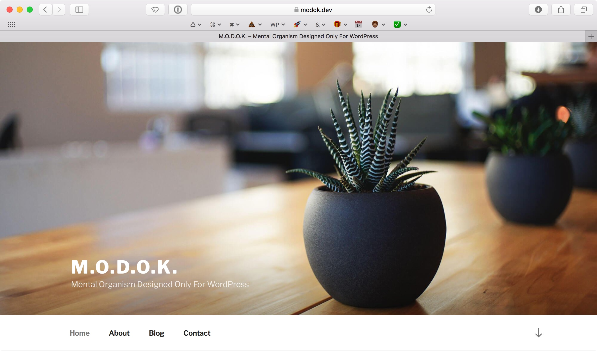
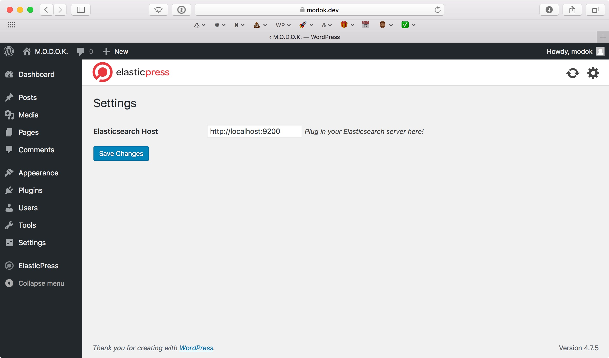
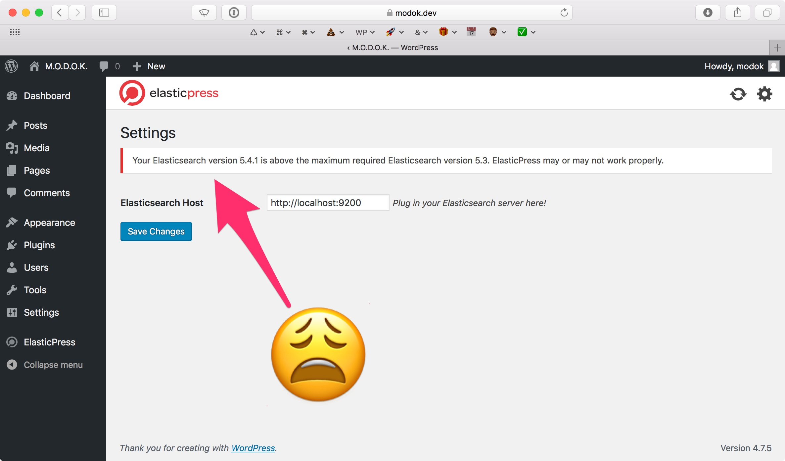

footer: boogah.org/wcoc17

# [fit] The Minimal Dev

# WordCamp OC 2017

# @boogah

[.hide-footer]

---

# Hi


^ I'm about to hit you with some pretty dry stuff up top. But I promise that I'll be quick about it.

---

# [fit] What is Valet?


^ Valet is a PHP development environment for, as the project site says, "minimalists". Originally developed for the Laravel PHP framework, Valet also supports other PHP projects, such as WordPress, through the use of "drivers".

^ While the primary distribution of Valet is for macOS, there are unofficial ports for the Windows and Linux folks in the crowd. With that being said, I'm going to be focusing on the macOS version today. Hope that's not a deal breaker for anyone. [pause for people to leave the room] Okay. Good.

---

# [fit] Why Valet?


^ If you saw how cluttered the area around my desk is, you'd be pretty hard pressed to call me a minimalist. But when it comes to development environments, I run a pretty tight ship.

^ One of the most appealing things, to me, about Valet is how lightweight it is. The core components—which are installed through Homebrew and the Composer dependency manager—take up no more than a few hundred MB on my laptop. On top of that, Valet uses around 10MB of RAM while idle.

---

# [fit] Why not Vagrant?


---

# [fit] Why not Docker?


---

# [fit] Why not X?


---

# [fit] Installing Valet


---

# [fit] Installing WP-CLI


---

# Install WP-CLI

```
→ curl -O https://raw.githubusercontent.com/wp-cli/builds/gh-pages/phar/wp-cli.phar
→ php wp-cli.phar --info
→ chmod +x wp-cli.phar
→ sudo mv wp-cli.phar /usr/local/bin/wp
```

<sub>**From [wp-cli.org](https://wp-cli.org/)**</sub>

---

# Install WP-CLI Valet commands

```
→ wp package install aaemnnosttv/wp-cli-valet-command
```

---

# [fit] Creating sites


---

# Create a site

``` [.highlight: 1]
→ wp valet new modok --admin_user=modok --admin_password=advanced-idea-mechanics
Don't go anywhere, this should only take a second...
Success: modok ready! https://modok.dev
```

---



---

# Destroy a site

``` [.highlight: 1]
→ wp valet destroy modok --yes
Success: modok was destroyed.
```

---

# [fit] Preserving workflows


---

# Supported workflows

* [Multisite](https://github.com/Objectivco/WordPressMultisiteSubdirectoryValetDriver)
* [WordPlate](https://github.com/wordplate/valet)
* [Skeleton](https://github.com/Baadier-Sydow/wordpress-skeleton-valet-driver)
* [Bedrock](https://github.com/aaemnnosttv/bedrock-valet-driver)

---

# [fit] Showing off


---

# Showing off

``` [.highlight: 1,2,10]
→ cd ~/sites/valet/modok
→ valet share
ngrok by @inconshreveable                                       (Ctrl+C to quit)

Session Status                online
Version                       2.2.4
Region                        United States (us)
Web Interface                 http://127.0.0.1:4040
Forwarding                    http://bf40fa0e.ngrok.io -> modok.dev:443
Forwarding                    https://bf40fa0e.ngrok.io -> modok.dev:443

Connections                   ttl     opn     rt1     rt5     p50     p90
                              0       0       0.00    0.00    0.00    0.00
```

---

# [fit] Exploration


---

# Installing Elasticsearch

```
→ brew install elasticsearch
```

---



---

# Maintaining Elasticsearch

```
→ brew pin elasticsearch
```

---



---

# [fit] Questions?


