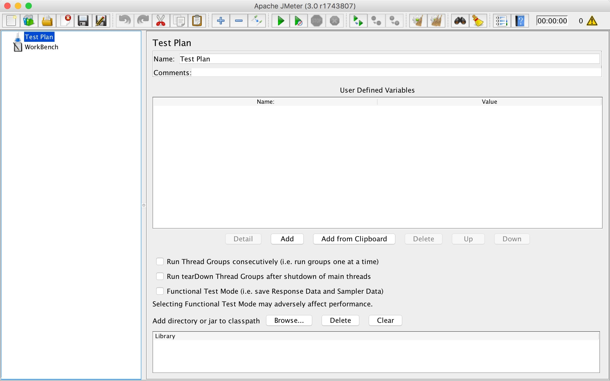
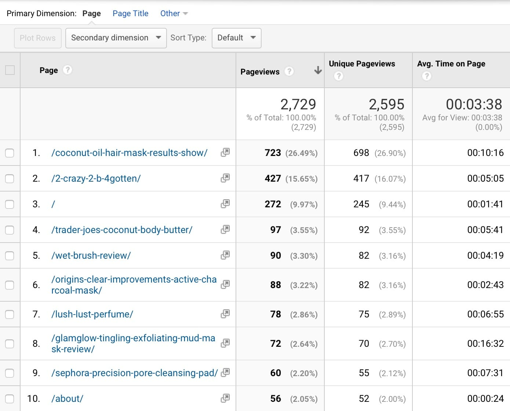

# [fit] Scaling WordPress
# [fit] With Load Testing

### https://boogah.org/wcsac16

---

## [fit] Let's talk about
## [fit] performance testing

^ Who here has ever run a load test before? What did you do with that data?

^ Up until about a year ago, I only ever ran quick tests to make sure a site wouldn't fall over when traffic was thrown at it. Then I was put on a project where the goal was to tune a site and optimize the code and the infrastructure around it.

^ I went from "Run test. Looks fine. Ship it." to "Run test. Make improvements. Run again. Make more improvements. Run again. Tweak test. Run again." and have managed to run hundreds of tests along the way.

^ Today I want to take some of what I've learned and share it with you.

---

# [fit] Why load test?

^ Load tests allow you simulate active traffic to your site in order to help you sniff out potential bottlenecks and failures.

---

# [fit] Common styles of
# [fit] performance testing

^ There are a few more outside of the ones I'm going to discuss here, but these four are the most relevant.

---

# [fit] Stress testing

^ Stress testing involves figuring out the upper limits of site and server capacity. This can show you how many users/transactions/etc. you can handle before your site starts returning errors.


---

# [fit] Spike testing

^ Spike testing utilizes a sudden increase in user load (ex. a jump from 5 users a minute to 50 users a minute) to see how the site and server respond to a (usually unexpected) uptick in users.


---

# [fit] Endurance testing

^ Endurance testing allows you to test site and server performance by sending a steady flow of traffic to a server over an extended period of time. This is great for catching memory leaks you might not otherwise find.


---

# [fit] Configuration testing

^ Configuration testing gives you the opportunity to check if a change to the site's configuration (core/plugin/theme upgrades, custom code changes, server changes, etc.) will have an impact on performance.


---

# [fit] YMMV

^ No matter which one of these four tests you run on your site — be it one or multiple — your mileage may vary. I say this because most testing tools don't take end user speed (3G, LTE, broadband, fiber, etc.) or environmental factors (browser, operating system, etc.) into consideration. Both of those things can have a considerable impact on the actual number of visitors your site can handle.

---

# [fit] Tools

---

# [fit] ApacheBench

^ Created to benchmark Apache web server installs, ApacheBench runs simple load tests on one URL at a time. If you're looking to do endurance testing, ApacheBench is an easy way to dip your toe into doing so without too much setup.

^ Sounds great, right? So what's the catch?

---

# ApacheBench Gotchas

* Single threaded.
* Not good for benchmarking high capacity servers.
* Works best when run from the same server as your site.
* Can only hit one URL at a time.
* Not much actionable data.
* Not a real browser test.
* No HTTP/2 support.

^ No matter how high you've set the concurrency level, or the number of CPUs on the machine you're testing from, ApacheBench will *always* use one thread. If you're running your site in a high capacity environment (managed WordPress hosting, tuned VPS, etc.) you won't get anywhere close to your site's actual throughput.

^ If you're okay with that though...

---

# Using ApacheBench

```
ab -n 100 -c 10 https://jasoncosper.com/
```

**Translation:** Have ApacheBench send 100 requests to my site. There should be no more than 10 requests running concurrently.

---

# ApacheBench Output

```
Server Software:        nginx
Server Hostname:        jasoncosper.com
Server Port:            443
SSL/TLS Protocol:       TLSv1.2,ECDHE-RSA-AES256-GCM-SHA384,4096,256

Document Path:          /
Document Length:        31927 bytes

Concurrency Level:      10
Time taken for tests:   34.163 seconds
Complete requests:      100
Failed requests:        0
Total transferred:      3253000 bytes
HTML transferred:       3192700 bytes
Requests per second:    2.93 [#/sec] (mean)
Time per request:       3416.350 [ms] (mean)
Time per request:       341.635 [ms] (mean, across all concurrent requests)
Transfer rate:          92.99 [Kbytes/sec] received

Connection Times (ms)
              min  mean[+/-sd] median   max
Connect:      244  259  18.5    253     343
Processing:   483 3015 2104.7   2566   11495
Waiting:      479 3011 2104.9   2564   11491
Total:        754 3274 2105.9   2813   11766

Percentage of the requests served within a certain time (ms)
  50%   2813
  66%   3673
  75%   4369
  80%   4677
  90%   6319
  95%   7818
  98%   9886
  99%  11766
 100%  11766 (longest request)
```

---

# [fit] If you have macOS
# [fit] you have ApacheBench

---

# Installing ApacheBench

If you're using Ubuntu to do your development work:

```
apt install apache2-utils
```

^ Most of the popular Vagrant development environments (see: VVV, VIP Quickstart, Chassis) use Ubuntu.

---

# [fit] h2load

^ If you *need* to test an HTTP/2 site one of the more modern takes on ApacheBench is h2load.

---

# h2load > ApacheBench

* HTTP/2 *and* HTTP/1.1 support out-of-the-box!
* It's multithreaded!
* Support for more than one URL!

---

# h2load Gotchas

* Limited actionable data.
* Not a real browser test.
* Best run from the same server as your site.

---

# Using h2load

```
h2load -n1000 -c100 -m10 https://jasoncosper.com/ https://jasoncosper.com/podcasts/
```

**Translation:** Have h2load send 500 requests to two URLs with 100 concurrent clients. And please don't go over 10 concurrent streams.

---

# h2load Output

```
starting benchmark...
spawning thread #0: 100 total client(s). 500 total requests
TLS Protocol: TLSv1.2
Cipher: ECDHE-RSA-AES256-GCM-SHA384
Server Temp Key: ECDH P-256 256 bits
Application protocol: h2

finished in 100.52s, 4.97 req/s, 143.56KB/s
requests: 500 total, 500 started, 500 done, 500 succeeded, 0 failed, 0 errored, 0 timeout
status codes: 500 2xx, 0 3xx, 0 4xx, 0 5xx
traffic: 14.09MB (14776906) total, 208.11KB (213106) headers (space savings 21.04%), 13.86MB (14531900) data
                     min         max         mean         sd        +/- sd
time for request:   442.43ms     100.21s      42.23s      26.80s    61.80%
time for connect:   236.00ms    301.97ms    268.62ms     19.25ms    63.00%
time to 1st byte:   678.74ms      46.08s      13.66s       9.60s    69.00%
req/s           :       0.05        0.12        0.07        0.02    74.00%
```

---

# [fit] Installing h2load
## [fit] https://boogah.org/inst-h2load

---

# [fit] JMeter

---




^ Isn't that the sort of user interface that only a total poindexter could love?

---

# Apache JMeter

* Created to test production web apps.
* Ridiculously configurable and extendable.
* Cross-platform (Mac, Windows, Linux)
* Fully multithreaded.
* GUI *and* CLI.
* Distributed remote testing support.

^ While there's no HTTP/2 support out of the box, a plugin is available. There's also plugins that enable sending your test traffic through real browsers.

---

# [fit] Installing JMeter
## [fit] https://boogah.org/inst-jmeter

---

# [fit] Creating test plans
# [fit] is easy*ish*

^ All it takes is configuring a proxy in your JMeter test and then pointing your browser at that proxy before browsing your site. JMeter will record everything you do while the proxy is on. Pages visited, login sessions, user cookies, etc.

^ If you Google "jmeter proxy", there's instructions on how get this going in the first few results. I don't want to get too in the weeds here.

---

# [fit] Don't test production environments
# [fit] from your laptop

^ It won't work. Mainly because you don't have the bandwidth to emulate hundreds (or thousands) of simultaneous users from your DSL/cable/fiber connection.

---

# [fit] Flood IO
## [fit] https://flood.io/

^ $12 an hour for unlimited users on their pay as you go plan. $99 a month for up to 15 hours worth of testing, also with unlimited users. There's even a free plan that gives you unlimited users for 5 minute, which is *perfect* for running spike tests.

^ In most cases, you can upload your JMeter tests and go.

---

# [fit] BlazeMeter
## [fit] https://www.blazemeter.com/

^ BlazeMeter is a little more expensive at $149 a month. They limit the number of users (1000 to start) and the amount of tests you can run (15, again to start) on a plan by plan basis.

^ However, BlazeMeter offers simple integrations with continuous integration services (Jenkins, TravisCI, CircleCI) as well as New Relic. That makes configuration testing way easier. They also give you the ability to run multiple tests at once. Why is that cool? Let's move on to...

---

# [fit] Real world
# [fit] scenarios

^ When people come to your site, not everybody is planning on doing the same thing. If you run an ecomm site with multiple products, people's carts are going to look different, right?

^ What about the folks who are just window shopping? And how about the person digging around for a recent blog post?

^ Say you have a media site. Not only are people browsing stuff linked off the front page, but folks are actively searching for older content.

^ How do you even come up with tests for all of these scenarios?

---

# [fit] Google Analytics
# [fit] is your friend

^ If you don't know what's popular with visitors — and you may not if you're dealing with a new client site — you can always drill down into Google Analytics.

---




^ If you view "Behavior > Site Content" in Google Analytics and modify the period to whatever you deem appropriate (last week, this time last year, the past three months, etc.) you can get a pretty good idea of popular pages that need to be tested.

---

# Useful Filters

* `?s`
* `product`
* `category`
* `tag`

^ You can even filter specific URLs to shine a light on behaviors. `?s` surfaces searches, `product` finds popular WooCommerce products even when people aren't completing the checkout process, and `category` & `tag` let you know if folks find your taxonomy pages useful.

---

# [fit] Bringing it
# [fit] all together

^ Once you gauge your popular pages, products, searches, actions, etc. it's time to come up with a plan.

^ For a WooCommerce site I was helping tune, making a plan wasn't that hard. We knew that the main action on the site was going to involve adding some items to the cart and checking out. But we also found out during our discovery process that there was a pretty steady stream of visitors browsing the site, running searches for products, and logging in to check on their orders.

---

# WooCommerce Test Plans

* Browse site.
* Browse site, perform multiple searches.
* Add products to cart, check out.
* Log in, browse site.
* Log in, visit "My Account" page.
* Log in, add products to cart, check out.

^ For each one of these scenarios, I performed multiple actions on the site, like an actual user would. Sometimes that meant browsing a few pages or running some searches, other times it meant going through the login process, adding products to my cart, and going through the entire checkout process.

^ In some cases, such as browsing the site and the checkout process, I created more than one test. On others, I replaced search strings with other terms pulled from a CSV file. Anything to increase the amount of variety the site would experience.

^ But to come back around to something I said earlier...

---

# [fit] YMMV

^ Just because this plan worked for this WooCommerce site, that doesn't mean it'll work for yours. Maybe people on your site tend to buy single items after getting a marketing email. Perhaps you're running a subscription site. Or you could offer coupon codes. Or, you know, your site doesn't even do ecomm at all.

^ Still, all of these things shape how your tests should be built.

---

# [fit] Okay, but
# [fit] how many users?

^ This is something that's dependent on your environment. Most shared hosting plans aren't going to be able to handle as much traffic as a VPS or managed host will.

^ When trying to come up with a baseline on a server I'm not familiar with, I start with 100 users over a five minute period and watch server load while the test is running. You can do this through a tool like New Relic. Or, if you have SSH access, directly on the server itself using a utility like `htop`.

^ Setting a reasonable performance budget is crucial. You need to figure out what your high end looks like and go from there.

---

# [fit] Push it
# [fit] to the limit

^ If the CPU load is too high, drop the number of users by 10 or 20. Too low, raise it. If you're chewing through your available RAM, ease up. If you've got plenty of RAM to spare, go harder. Lather. Rinse. Repeat.

^ The real trick is figuring out the point where you either stop or start seeing errors and placing yourself on the right side of it.

---

# [fit] My limit
# [fit] seems kinda low

^ So you've figured out how many people can actually do things on your site and you're sort of underwhelmed. Happens to the best of us, promise.

^ Are you caching every possible page element? Even on dynamic pages, using something like Rarst's "Fragment Cache" plugin (available on GitHub) can help.

^ Have you audited your site lately? The Query Monitor plugin (available in the repo) or runcommand's `profile` WP-CLI command can help surface things that are chewing up too many resources.

^ Could you stand to get rid of a few plugins? That one that lets you oEmbed Vine videos has had a comparable function in core for a while now. Do you really get enough traffic from App.net to justify crossposting to it?

^ Maybe you've outgrown your plan. If your host doesn't offer something that'll allow you to grow within your budget, maybe you've outgrown your host.

---

# [fit] Questions?

^ I could keep nerding out on this stuff all day, but I figured I'd leave some time for questions. Anyone?

---

# [fit] @boogah
## https://jasoncosper.com/
## https://hipsum.co/
