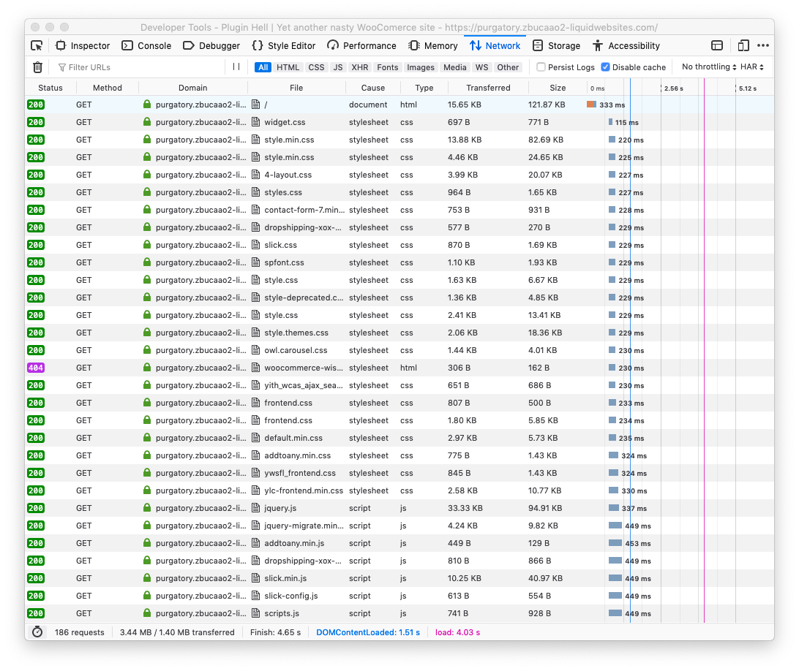
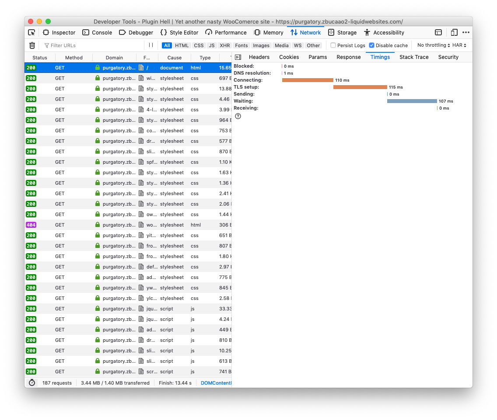

# [fit] Chasing
# [fit] Waterfalls

---

## I'm Cosper

^ AKA: The Human Marquee Tag, Post Formats Malone, Add Action Jackson, Fat Mullenweg

^ I'm the Senior Performance Engineer at Liquid Web for the Managed WordPress and Managed WooCommerce Hosting platforms.

^ That means I spend a not insignificant amount of time answering the question:

---

# Why is my site so slow?

^ Now, before you get the wrong idea about our hosting, let me clear something up. When people become a Liquid Web customer — or, honestly, the customer of any managed WordPress host — they're not usually bringing in a brand new site. Most of these folks are working with sites that are a few years old.

^ By this point, these customers have tried a number of plugins to solve the problems that they've had. Some of those plugins have worked. Others haven't.

^ Of the plugins that haven't, some might not have cleanly uninstalled, leaving garbage in the database. Of the ones that have, there could be a few that might be using outdated methods, old JavaScript libraries, or leveraging third party services that aren't as concerned as you are with your site's load time.

---

# [fit] Every (fraction of a)
# [fit] second counts

^ And, since you're sitting in this room today, I'd like to hope that you're concerned with your site's load time because...

^ :read slide:

^ A recent Akamai report cited that just a two second delay on page load reduced, on average, the amount of time that customers spent on the site by 51%. And Salesforce has noted that even a 100-millisecond delay in page load hurt conversion rates by up to 7%.

^ Let's look at some real world examples so y'all can see what I mean.

---

Courtesy [WPO stats](https://wpostats.com/2015/11/20/staples-load-time.html)

^ While Staples is no Dunder Mifflin, they saw a 10% increase in their conversion rate by reducing their load time.

---

Courtesy [WPO stats](https://wpostats.com/2016/12/27/aliexpress-load-time.html)

^ For those of you who don't know about AliExpress, they're basically China's version of eBay. Except, since so many of the world's goods are produced in China, Chinese manufacturers hang out on AliExpress and offer customers a way to buy goods directly and in bulk at wholesale rates.

---

Courtesy [WPO stats](https://wpostats.com/2018/05/11/missguided-revenue.html)

^ Missguided is a UK based retailer that sells women's apparel in the fast fashion vertical. A kind of online first Forever 21, if you will.

^ Bazzarvoice provides, amongst other things, hosted ratings and reviews for ecommerce sites. It's a nice service because they apply weighting and other special sauce to the content to show relevant reviews first. And that can increase conversions, but when using their service adds 4 seconds to your page load time for mobile users, that's a problem. And, at that point, you have to ask yourself if it's worth the trade-off or not.

---

# [fit] Every (fraction of a)
# [fit] second counts

^ Now, while I know that everyone in this room isn't running a site at the scale of Staples, AliExpress, or even Missguided, I'm pretty sure that you're all still interested in how you could increase revenue and engagement by making your site faster.

^ Now you could install any combination of optimization plugins, tweak a few settings, and just call it a day. And if that's the level of effort you want to commit to, cool. But you're not truly understanding where your site's trouble areas are by effectively punting the issue until later.

^ And the problem with that is that "later" is usually right in the middle of an uptick in traffic on your site. So instead of waiting, let's meet one of my favorite tools for troubleshooting slow sites...

---

# The waterfall view

^ How many of you are familiar with your favorite browser's development tools? Okay. Out of those, how many of you have spent any time looking at the network tab?

^ Okay. So. For those of you that haven't...

^ In the network tab of every major browser's developer tools is a list of resources that your browser has attempted to download in order to render the page. All the way over to the right is a timeline that shows you how long each of those resources took to load. That timeline is commonly referred to as the waterfall view.

^ Named because of its resemblance to falling water, you can use this view to get an idea of any bottlenecks that may be occurring while visitors are browsing your site.

^ Let's see what this looks like in Firefox.

---

^ As I said, to the right, you'll see a timeline of all of the resources used by the page that you're currently on.

^ The first request that gets made — and the one that all the remaining ones on your page have to wait on — is for the page itself. That's because it's telling the browser what all it needs to render the site as you've intended.

^ You'll notice that, in this case, from the second request on, that all the JavaScript and CSS (which are enqueued in the header by default) are downloaded in parallel. That's because this server supports a newer version of the HTTP protocol, HTTP/2. Where HTTP/1.1 waits for resources to finish before asking the server for more data, HTTP/2 downloads as much as it can in parallel.

---

^ To demonstrate the speed difference between HTTP/2 and HTTP/1.1, here's a brief demo from the folks at ImageKit where a larger photo has been split up into 100 small images and loaded via both versions of the protocol. As you can see, HTTP/2 smokes HTTP/1.1.

^ If you look at the waterfall on your site and see a more staggered timeline after your browser's initial request, there's a possibility that you're still on HTTP/1.1. It's a good idea to use an HTTP/2 test tool (KeyCDN maintains one) to know for sure, but if you find your server using HTTP/1.1, contact your host to see what their plans are to migrate customers to servers that support HTTP/2.

---

^ Okay. Let's hop back over to the waterfall view. You should be able to drill down on the timings for every item by clicking on each resource. There, you'll see a breakdown of the time spent handling the request.

^ Slow DNS resolution needs to be handled at the host level or can be improved by leaning on an external service such as Amazon's Route 53, Google Cloud DNS, or Cloudflare DNS.

^ Long connections and TLS negotiations usually mean the web server is lagging. Either it can't handle the number of connections you're throwing at it or it happens to be configured poorly. Either way, you need to talk with your host — or whoever is hosting that resource.

^ After that, the wait you see is how long your server takes to render and serve the resource. Since flat files like images, CSS, and JavaScript don't need to be rendered by PHP, the only thing that matters there is the size of the files and how long it takes for your browser to download them. But with dynamic pages, the longer the wait, the more complex things probably are under the hood. Perhaps, due to years of random plugins and neglect, things are unintentionally complex.

---

# Wat do?

^ Well, for rendering and serving pages, the best thing you can do is cache everything. Either using server side caching like Varnish or an nginx microcache — which is done for you on a managed WordPress host — or leaning on a plugin like WP Rocket or WP Super Cache. You should also make sure that there are exceptions in place for slugs like `cart`, `checkout`, and `my-account`.

^ For uncached pages — like the cache exceptions that I just mentioned as well as ones that aren't pre-cached — you'll still need to do what you can to optimize your core WordPress install. Going through and clearing out old plugins is a good start.

---

# Kondo that ish

^ Seeing as how it's the first weekend of April, maybe a little spring cleaning is in order. How many of you go in and regularly look over your active plugins to determine what all you're still using?

^ What about reevaluating that the plugins you have are still the best ones for the job? Or that you're still using the features a plugin provides.

^ You were all excited to add Live Chat to your site, but are customers actually chatting with you? Do you still need that backup plugin when your host provides backups? How many people actually click on your share buttons?

^ Going through and determining the usefulness of each component of your site may sound painful if you've got a ton of plugins installed, but if you keep notes on each pass that you do, every consecutive reevaluation is easier.

---

# But I need
# all of it

^ Honestly, I bet that you don't. But that's okay. You should still go through and look at what your active plugins are doing to your uncached page load.

^ If you've got a little money to throw around, you can use an Application Performance Management solution like New Relic in conjunction with 10up's New Relic Reporting plugin to passively capture a bunch of data — that you can drill down into — while your visitors browse your site.

^ If you're either broke or a cheapskate, John Blackbourn's Query Monitor plugin can be super helpful. It doesn't replace having an APM like New Relic, but it does let you drill down into slow or large MySQL queries and can help you find the plugins responsible for them. Query Monitor also lets you quickly see what styles and scripts are being loaded on any page you might visit and what their dependencies are.

^ On top of that, Query Monitor has a handful of extensions that add support for other plugins and themes. The rub is that you can only collect this data while you or any other admin browses the site.

---

^ For every change that you make, it's a good idea to refresh the page that you have dev tools open on, and see what it did to your waterfall. Are things faster now? Great! Did everything get slower? Reactivate the plugin, check your waterfall again, and make sure the plugin wasn't doing something that you weren't aware of.

^ You've hopefully noticed that I said "reactivate" there instead of "reinstall". When you're tidying up your site, it's always a good idea to hold off on deleting plugins outright until you know for sure that you absolutely want to get rid of them.

^ It's also a good idea to back up obsessively. Once before you start doing your cleanup, once or twice during the cleanup, and once after you're done. Nobody wants to find out they accidentally deleted a custom plugin that they can never get back, right?

---

# For the true obsessives

^ If you're the sort that likes to go back and look at how the performance of your page has improved over time, you can actually go in and save an archive of your network waterfall view from any major browser in a format called HAR.

^ I personally like to date and timestamp my HAR files and save them into folders based on the domain I'm working on. That way, if I have to dig into something months later, I can go back and see how things looked the last time I laid hands on the site.

---

### `bit.ly/savehar`

^ If you'd like to learn how to save a HAR file from your browser, Cloudflare has a handy resource that covers saving them out from Firefox, Chrome, Safari, and Edge.

^ Should you find yourself wishing to view one of these saved files in the future, there's a number of viewers available by way of a quick search for "HAR Viewer". My favorite is the one over at `softwareishard.com`, but Google's is pretty nice. No surprise there though.

---

# But wait, there's more!

^ While concatenating your CSS and JavaScript into a few files is actually an anti-pattern with HTTP/2 — because of how HTTP/2 favors many smaller files over 3 or 4 large ones — if you find yourself with more than ~20 CSS or JavaScript resources, you'll save yourself bytes on every page load by not having requests for all of those files in your header or footer.

^ One person I assisted had over 30 CSS and 50 JS files that were being loaded on almost every page view on their site. That's 30+ `style` tags and 50+ `script` tags bulking up the page. Through a little bit of concatenation (thanks Autoptimize) and some strategic exclusions, I managed to trim things down to under 10 of each and knocked a few kilobytes off the overall page size.

^ As always, to make sure you're doing the right thing, keep an eye on that waterfall view.

---

# What about images?

^ Who here has made sure that all of their site's images are optimized? How are you doing that? Are you pre-processing them before uploading them? Is everyone who works on your site also doing this?

^ Chances are, no matter how careful you've been, that you have at least a few images that could stand to get a little lossless compression.

^ There are plugins that handle compressing images in your media library. If you're running a site where multiple people are working on it, using a plugin is a good idea. TinyPNG and EWWW Image Optimizer both work well, so long as your environment supports them. But if you're dealing with a custom theme, I suggest downloading it via SFTP and dropping the folder into a desktop solution like ImageOptim for Mac to compress all the images in there as well. Every little bit counts, after all.

---

# More about images

^ In the case of images, using a content delivery network (CDN) is a good idea. CDNs serve up static resources from servers that are geographically close to visitors, which cuts down on potential network latency. The only problem — for all my cheapskates in the crowd at least — is that a decent CDN costs money.

^ Both KeyCDN and Fastly work wonderfully. But they can get expensive if your site is moderately popular. Cloudflare has a free CDN, but you basically have to let your site be served through their edge servers if you want to use it. Or at least that's how it was the last time I looked. Still, if you're not comfortable with that, you're out of luck.

^ There's a chance that I surprise a few of you by suggesting this, but the Site Accelerator module in Jetpack is actually pretty decent if you already have Jetpack installed. On top of that, it's totally free. So that's nice.

^ The Jetpack Site Accelerator serves your images and static files through the `wordpress.com` CDN and even optimizes them where it can.

---

# 3rd party scripts

^ Honestly, one of the bigger drags on page load times can come from third party scripts. Tracking for ad networks, specialized analytics services, developer utilities, social share functionality, video players, live chat, and so on.

^ All of these things promise to make your life as a site owner easier. And a lot of them do. But the trick is not loading your site down with so many that you start losing sales.

---

### `bit.ly/thirdpartyscripts`

^ One of the best resources I've found for digging up notoriously slow 3rd party scripts is the `third-party-web` repository on GitHub. They take data from the HTTP Archive initiative — which crawls ~4 million sites — to show average 3rd party script execution time from across the web. This is handy when you want to check any external scripts loading on your domain against what the rest of the internet is seeing.

^ Say you're using Zendesk's Live Chat on your site. To make sure your customers get help wherever they might need it, you load Live Chat on every page. According to the repo, Zendesk JS currently loads in about 508ms. To be fair, thanks to browser caching, once the script is downloaded, it shouldn't need to be downloaded again. But you're still guaranteeing that everyone who visits your site loads that half second of JavaScript.

^ Instead, consider loading the live chat only on your contact, support, and logged in user account pages. Sure, people might have to dig for live chat, but the majority of your users won't have to deal with a slower site.

---

### `webpagetest.org`

^ Now that you've had a chance to look at all of the things that you can dig into with the waterfall view, I'd like to take the last minute or so of my talk to talk about WebPagetest. Outside of using a browser locally, WPT is one of my favorite tools for digging into the waterfall. You can run 1 to 9 tests on a single domain from every browser (Safari, Firefox, Chrome, Edge, IE 11, Opera) and device (iOS and Android) from locations all around the world. It'll even give you performance reviews and things to look into if you're feeling stuck.

---

# Questions?

^ Anyway... questions?
